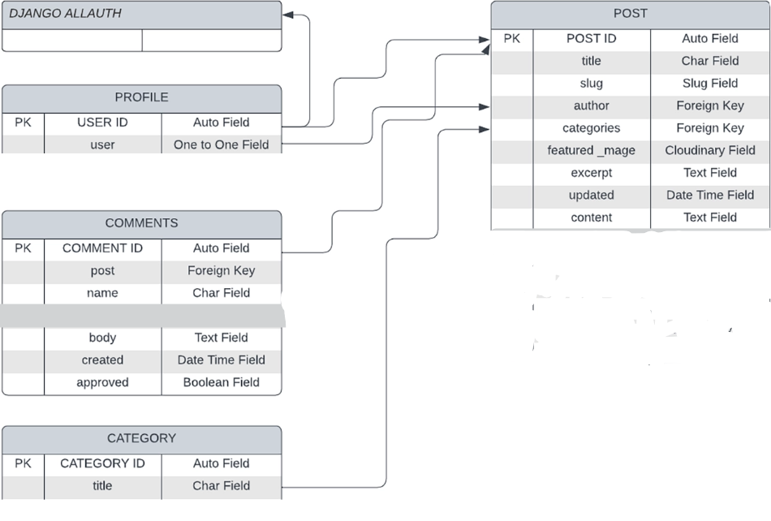
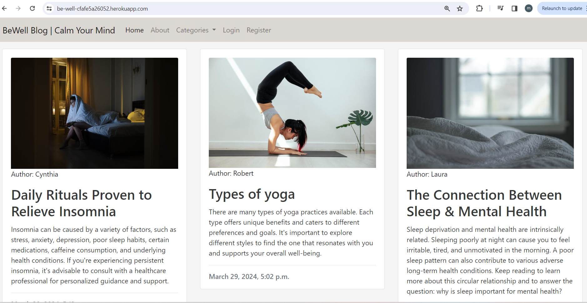
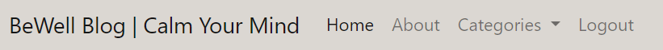
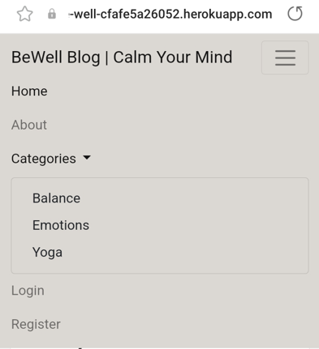
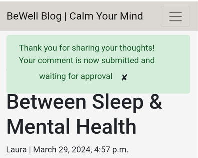
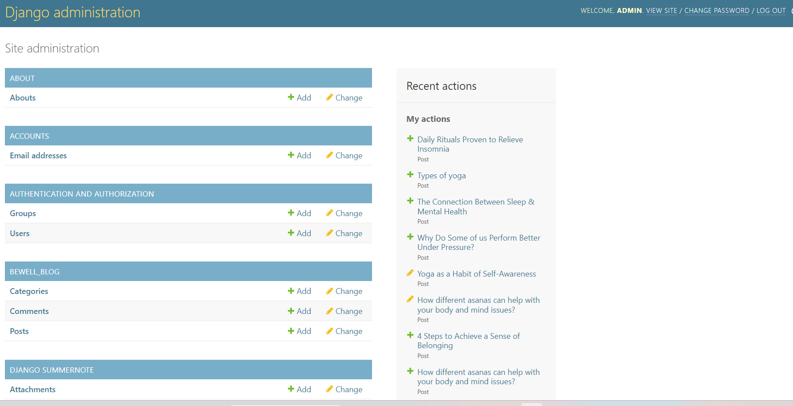

<h1>BeWell Blog</h1>
BeWell Blog is a website with posts about mental health, balance and stress. It's a place where users can read about methods to help themselves and understand that they're not alone in their struggles.
On the website users not only can read blog posts but also, when registered and logged in, comment on them, engaging in conversations with other registered users.


<h1>Live Site</h1>
A live version of the site can be found <a href="https://be-well-cfafe5a26052.herokuapp.com/" target="_blank">here</a>
<br>


<h1 id="contents">Contents</h1>

- [Introduction](#introduction)
 - [User Experience - UX](#user-experience)
   - [User Stories](#user-stories)
   - [Agile Methodology](#agile)
   - [The Scope](#the-scope)
- [Design](#design)
   - [Colours](#colours)
   - [Media](#media)
   - [Database](#database)

- [Features](#features)
   - [Homepage](#homepage)
   - [Navigation Desktop](#navigation-desktop)
   - [Navigation Mobile](#navigation-mobile)
- [Technologies](#technologies)
   
- [Development & Testing](#testing)
   - [Database](#database)
   - [Manual Tests](TESTING.md)
- [Deployment](#deployment)
- [Credits](#credits)

<h1 id="introduction">Introduction</h1>

BeWell Blog is a full stack Django project that runs on Heroku.

<h1 id="user-experience">User Experience - UX</h1>

<a href="#top">Back to the top.</a>


<h2 id="user-stories">User Stories</h2>


* As a website user, I can:

1. I can view a paginated list of posts so that I can choose which post I want to view.
2. I can click on a post so that I can read the full text.
3. I can create and register an account so that I can comment on a post.
4. I can view comments on an individual post so that I can read the conversation.
5. I can click on the About link so that I can read about the site.
6. I can choose between different categories so that I can view posts in category that interests me the most.

* As an authenticated website user, I can:

1. I can comment on a post so that I can say what I think and engage in a conversation.
2. I can modify or delete my comments.
3. I can view comments on an individual post so that I can read the conversation.

* As a website superuser, I can:

1. I can view comments on an individual post.
2. I can create draft posts so that I can finish writing the content later.
3. I can create or update the about page content so that it is available on the site.
4. I can create, read, update and delete posts.
5. I can approve or disapprove comments so that I can filter out inappropriate or insulting comments.


<h2 id="agile">Agile Methodology</h2>


The Agile Methodology was used to plan this project. This was implemented through Github and the Project Board which can be seen here -  <a href="https://github.com/users/madeleine2086/projects/2/views/1" target="_blank"> BeWell Blog User Stories</a>

<h2 id="the-scope">The Scope</h2>


* To provide users with a simple, easy to navigate and visually pleasing website.
* To provide a website with
* To allow users to interact with the website by commenting.


<h1 id="design">Design</h1>

<a href="#top">Back to the top.</a>

<h2 id="colours">Colours</h2>

BeWell Blog was designed to be a simple website that evokes a sense of tranquility, relaxation, and peacefulness. The aim was to create a soothing atmosphere for users visiting a website.
I decided to stick with the neutral colour palette to match the idea behind the blog and maintain a nice visual contrast when viewing the site. Colours used are whitesmoke for the body, also silver, #373938, #dbd7d2, #5d9857, #8d9292, #2d3636, #363535, #fefefe rgb(255, 250, 250) and rgb(250, 250, 250).
Bootstrap 5 native font stack was utilised.


<h2 id="media">Media</h2>


* All photographs used on the blog are from<a href="https://www.pexels.com/" target="_blank"> Pexels.com </a> 

* All posts on the page are from<a href="https://www.talkspace.com/" target="_blank"> Talkspace </a> 


<h2 id="database">Database Diagram</h2>




<h1 id="features">Features</h1>

<a href="#top">Back to the top.</a>


<h2 id="homepage">Homepage</h2>

* It is the landing page of the website which user can see first when the site loads. The homepage displays the latest 6 posts.



<h2 id="navigation-desktop">Navigation Desktop</h2>

<a href="#top">Back to the top.</a>

* The site navigation is done through the navigation bar at the top of each page & this is consistant throughout the website.

* The navigation bar at the top of each page is sticky to allow access to the navigation at any time.

* Options on the navigation bar change depending on whether the user is logged in or not, or is an admin/staffuser or not.





<h2 id="navigation-mobile">Navigation Mobile</h2>

<a href="#top">Back to the top.</a>




<h2 id="post-details">Posts Details</h2>

<a href="#top">Back to the top.</a>

* When a regular user is visiting they can view and read a post onthe post detail page.

* When an authenticated user is logged in they can also comment on a post.

* If a comment is submitted this will have to be approved by an Admin user before it is displayed on the site.





<h2 id="all-posts">All Posts</h2>

<a href="#top">Back to the top.</a>

* To see all posts on a paginated page click the blog logo or home button.


<h2 id="categories">Categories</h2>

<a href="#top">Back to the top.</a>

* To see categories for posts click the Category menu in the navbar and click on selected category in a dropdown menu. All post belonging to chosen category will be displayed.


<h2 id="admin-backend">Admin on the Backend</h2>

<a href="#top">Back to the top.</a>

* Superusers or staffusers are able to managae the posts and categories on the backend.




<h2 id="future-features">Possible Future Features</h2>

<a href="#top">Back to the top.</a>

* User Profile feature and Admin functionality on the frontend.

* Social login to allow the user to signup using Facebook or Google 

* Password reset on the users profile page


<h1 id="technologies">Technologies</h1>

<a href="#top">Back to the top.</a>

<h2 id="languages">Languages Used</h2>

* [HTML 5](https://en.wikipedia.org/wiki/HTML/)
* [CSS 3](https://en.wikipedia.org/wiki/CSS)
* [JavaScript](https://www.javascript.com/)
* [Django](https://www.python.org/)
* [Python](https://www.djangoproject.com/)

<h2 id="django-packages">Django Packages Used</h2>

* [Gunicorn](https://gunicorn.org/)<br>
   As the server for Heroku
* [Cloudinary](https://cloudinary.com/)<br>
   Was used to host the static files and media
* [Dj_database_url](https://pypi.org/project/dj-database-url/)<br>
   To parse the database URL from the environment variables in Heroku
* [Psycopg2](https://pypi.org/project/psycopg2/)<br>
   As an adaptor for Python and PostgreSQL databases
* [Summernote](https://summernote.org/)<br>
   As a text editor
* [Allauth](https://django-allauth.readthedocs.io/en/latest/installation.html)<br>
   For authentication, registration, account
   management
* [Crispy Forms](https://django-crispy-forms.readthedocs.io/en/latest/)<br>
   To style the forms
* [Whitenoise](http://whitenoise.evans.io/en/stable/)<br>
   For static CSS on Heroku

 


<h2 id="frameworks">Frameworks - Libraries - Programs Used</h2>

* [Bootstrap](https://getbootstrap.com/)<br>
   
* [Jquery](https://jquery.com/)<br>
   
* [Git](https://git-scm.com/)<br>
   
* [GitHub](https://github.com/)<br>
   
* [Heroku](https://id.heroku.com)<br>
   
* [ElephantSQL](https://www.elephantsql.com/)<br>
   
* [VSCode](https://code.visualstudio.com/)<br>
  
* [Fontawesome](https://fontawesome.com/)<br>
   
* [Google Chrome Dev Tools](https://developer.chrome.com/docs/devtools/)<br>


<h1 id="testing">Development & Testing</h1>

<a href="#top">Back to the top.</a>


<h2 id="testing-results">Manual Testing Results</h2>

* Manual Testing results [here](TESTS.md)


<h1 id="deployment">Deployment</h1>

<a href="#top">Back to the top.</a>


## Heroku

The project was deployed via <a href="https://id.heroku.com/login" target="_blank">Heroku</a>, and the live link can be found here: <a href="https://be-well-cfafe5a26052.herokuapp.com/" target="_blank">BeWell Blog</a>

This project was developed utilising the <a href="https://github.com/Code-Institute-Org/gitpod-full-template" target="_blank">Code Institute Template for Gitpod</a>.

Before deploying to Heroku pip3 freeze > requirements.txt was used to add all dependencies for deployment and created the Procfile with web: gunicorn cocktailnerd.wsgi.

Created .slugignore with /documentation, README.md & TESTING.md as paths to ignore in Heroku as I don't want the documentation to upload to Heroku.

This project was deployed to Heroku using the Heroku CLI details below

* Login
To use the CLI you must log in to your Heroku account. To do this you will need to
enter the command heroku login -i in the terminal. It requires the email and
password you used to sign up. If you have enabled multi-factor authentication (a
recommended security practice) then instead of your password you need an API key.
To get the API key go to your account settings and scroll down to the section ‘API
Key’. Click reveal and copy that, then paste it into the password prompt.

<br><br>

* Creating A Heroku App
Now that you are logged in, the first thing is to create a new app. Heroku creates a
URL based on your app name, so it must be unique not only on your account, but
across the whole site. You may need to try a few different names. To create an app
use the following command, where myapp is the name of your app.
 
<br><br>

* Here the app heroku-cli-example has been created with an output of the website
URL. It also displays and sets the git remote repository which will be used to deploy.
By default the region will be set to the US. If you would prefer a server based in the
EU then you can specify the region with the flag EU

* When you push code to Heroku it will look at the repository contents to decide how
to build the project. One of the factors taken into consideration is the package file.
With a Python project the standard file is a requirements.txt file, which will have the
list of packages needed to run the project. If this file is present it will build the project
using the Python buildpack.

* It is also possible to specify the buildpack manually. More information about
buildpacks can be found in the documentation. To check the buildpack for the
project you can enter heroku buildpacks in the terminal.

## Deployment Steps On Heroku.

* Run this command pip3 install pip3 install 'django<4' to install django.
* Added these libraries:pip3 install dj_database_url psycopg2,pip3 install dj3-cloudinary-storage
* Created requirements.txt file where I can save all the libraries I've installed:pip3 freeze --local > requirements.txt
* To create my project typed this command:django-admin startproject cocktailnerd
* To create my app:python3 manage.py startapp cocktailapp
* To make this app work, Into the setting.py file inside INSTALLED_APPS added cocktailapp
* To migrate changes typed this command:python3 manage.py migrate
* To run the test if the project is working python3 manage.py runserver
* When deploying for the first time on Heroku, you must first register with Heroku.
* Create your project name and location.
* To add Database into the app, Locate in the Resources Tab, Add-ons, search and add 'Heroku Postgres'
* Copy DATABASE_URL value, by going into the Settings Tab, click reveal Config Vars, Copy Text
* In your workspace Create new env.py file.
* Import os library:import os
* Set environment variables:os.environ["DATABASE_URL"] = "Heroku DATABASE_URL"
* Add in secret key:os.environ["SECRET_KEY"] = "mysecretkey"
* Add Secret Key to Config Vars in Heroku settings:SECRET_KEY, "mysecretkey"
* Add env.py file to the settings.py file:import osimport dj_database_urlif os.path.isfile("env.py"):import env
* Remove the insecure secret key and replace - links to the SECRET_KEY variable on Heroku:SECRET_KEY = os.environ.get('SECRET_KEY')
* Comment out the old DATABASES variable in setting.py file and add this instead:DATABASES = { 'default': dj_database_url.parse(os.environ.get("DATABASE_URL"))}
* Save all files and Make Migrations:python3 manage.py migrate
* Make account with Cloudinary To get static and media files.
* From Cloudinary Dashboard, Copy your CLOUDINARY_URL:
* Add Cloudinary URL to env.py file:os.environ["CLOUDINARY_URL"] = "cloudinary://************************"
* Add Cloudinary URL to Heroku Config Vars:"cloudinary://************************"
* Temporalliy add DISABLE_COLLECTSTATIC inside the heroku config Vars:DISABLE_COLLECTSTATIC, 1
* Add Cloudinary Libraries to settings.py installed apps:INSTALLED_APPS = ['cloudinary_storage', 'django.contrib.staticfiles', 'cloudinary']
* In the settings.py file under the STATIC_URL = 'static/' add:

```python
STATICFILES_STORAGE = 'cloudinary_storage.storage.StaticHashedCloudinaryStorage'
STATICFILES_DIRS = [os.path.join(BASE_DIR, 'static'), ]
STATIC_ROOT = os.path.join(BASE_DIR, 'staticfiles')

```
* Place under the BASE_DIR line in settings.py:TEMPLATES_DIR = os.path.join(BASE_DIR, 'templates')
* Change the templates directory to TEMPLATES_DIR Place within the TEMPLATES array:TEMPLATES = [{'DIRS': [TEMPLATES_DIR],],},},]
* Add Heroku Hostname to ALLOWED_HOSTS:ALLOWED_HOSTS = ["project4-cocktail-nerd.herokuapp.com", "localhost"]
* Create 3 new folders on the root directory: media, static, templates
* Create Procfile needed for Heroku on the root directory and inside the file add this:web: gunicorn dentist.wsgi
* Before deploying on heroku make sure: DEBUG = False Remove DISABLE_COLLECTSTATIC from the config vars.
* Created .slugignore with /documentation, README.md & TESTING.md as I don't want the documentation to upload to Heroku.
* Click **Enable Automatic Deploys** for automatic deployment when you push updates to Github.
* Select the correct branch for deployment from the drop-down menu and click **Deploy Branch** for manual deployment.


### Forking the GitHub repo

If you want to make changes to the repo without affecting it, you can make a copy of it by 'Forking' it.

<ol>
    <li>Log in to your GitHub account</li>
    <li>Navigate to the repository <a href="https://github.com/madeleine2086/pp4" target="_blank"><strong>HERE</strong></a></li>
    <li>Select the 'Fork' button in the top right corner of the page (under your account image)</li>
    <li>The repo has now been copied into your own repos and you can work on it in your chosen IDE</li>
    <li>If you have any suggestions to make regards to the code to make the site better, you can put in a pull request</li>
</ol>

### Cloning the repo with GitPod

<ol>
    <li>Log in to your GitHub account</li>
    <li>Navigate to the Repository <a href="https://github.com/madeleine2086/pp4" target="_blank"><strong>HERE</strong></a></li>
    <li>Select the 'Code' button above the file list on the right had side</li>
    <li>Ensure HTTPS is selected and click the clipboard on the right of the URL to copy it</li>
    <li>Open a new workspace in GitPod</li>
    <li>In the bash terminal type 'git clone [copy url here from step 4]'</li>
    <li>Press enter - the IDE will clone and download the repo</li>
</ol>

### Github Desktop
<ol>
    <li>Log in to your GitHub account</li>
    <li>Navigate to the Repository <a href="https://github.com/madeleine2086/pp4" target="_blank"><strong>HERE</strong></a></li>
    <li>Select the 'Code' button above the file list on the right had side</li>
    <li>Select 'Open with GitHub Desktop'</li>
    <li>If you haven't already installed GitHub desktop application - you will need to follow the relevant steps to do this</li>
    <li>The repo will then be copied locally onto your machine</li>
</ol>

### Download and extract the zip directly from GitHub
<ol>
    <li>Log in to your GitHub account</li>
    <li>Navigate to the Repository <a href="https://github.com/madeleine2086/pp4" target="_blank"><strong>HERE</strong></a></li>
    <li>Select the 'Code' button above the file list on the right had side</li>
    <li>Select 'Download Zip'</li>
    <li>Once you have the Zip downloaded, open it with your prefered file decompression software</li>
    <li>You can then drag and drop the files from the folder into your chosen IDE or view/edit them on your local machine</li>
    <li>If you want to create a web-app from the repo please follow the instructions in "Project Deployment"</li>
</ol>


<h1 id="credits">Credits</h1>

<a href="#top">Back to the top.</a>

* Code Institute "I think therefore I blog" walkthrough helped me understand and setup the base code for BeWell Blog.

* Posts are from <a href="https://www.talkspace.com/" target="_blank"><strong>Talkspace</strong></a>

* Images used on the website are from <a href="https://pexels.com/" target="_blank"><strong>Pexels:</strong></a>
    1.    https://www.pexels.com/photo/flexible-woman-doing-scorpion-yoga-asana-7592436/
    2.    https://www.pexels.com/photo/photo-of-a-woman-sitting-on-the-bed-while-covered-by-a-white-blanket-6951509/
    3.    https://www.pexels.com/photo/silhouette-of-man-standing-on-sandy-terrain-3876401/
    4.    https://www.pexels.com/photo/woman-sitting-on-brown-stone-near-green-leaf-trees-at-daytime-1234035/
    5.    https://www.pexels.com/photo/selective-focus-photography-of-person-using-iphone-x-1542252/
    6.    https://www.pexels.com/photo/a-judge-holding-a-paper-6077356/
    7.    https://www.pexels.com/photo/woman-wearing-gray-blazer-writing-on-dry-erase-board-1181534/
    8.    https://www.pexels.com/photo/matchsticks-on-the-yellow-surface-6837562/
    9.    https://www.pexels.com/photo/person-lying-on-bed-covering-white-blanket-271897/
    10.   https://www.pexels.com/photo/positive-young-african-american-lady-holding-light-bulb-in-hand-on-gray-background-3973059/
    11.   https://www.pexels.com/photo/grayscale-portrait-of-woman-594421/
    12.   https://www.pexels.com/photo/woman-practicing-yoga-3822191/
    13.   https://www.pexels.com/photo/man-showing-distress-3777572/
    14.   https://www.pexels.com/photo/women-practicing-yoga-3822164/

* Structure of this README.md file was inspired by former <a href="https://github.com/artcuddy" target="_blank">Code Institute student's</a> README.md, which is the best, most detailed README file I have seen so far. Thank you to Artcuddy for making it available to other students.


### Other resources

* [Stack Overflow](https://stackoverflow.com/)
* [Codemycom](https://www.youtube.com/c/Codemycom)
* [Tech with Tim](https://www.youtube.com/@TechWithTim)
