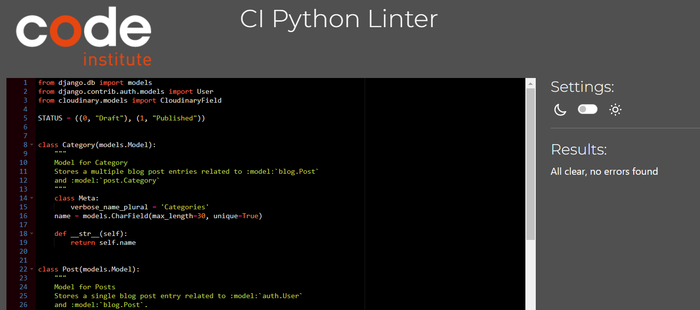
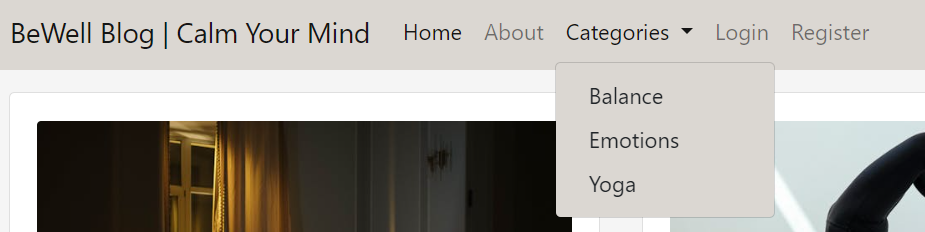

<h1 id="top">BeWell - Testing</h1>

Back to the [README](README.md)

* [PEP8](http://pep8online.com/) 
   PEP8 was used to validate all the Python code:
   - bugs detected in some files (models.py)
   

   - bugs then were fixed (models.py)
   

   * All files in about, my_project and bewell_blog apps came back clear 
   except settings.py where's 1 line too long. It's in AUTH_PASSWORD_VALIDATORS and cannot be shortend.
   
* [W3C - HTML](https://validator.w3.org/) 
   W3C- HTML was used to validate all the HTML code
   
* [W3C - CSS](https://jigsaw.w3.org/css-validator/) 
   W3C - CSS was used to validate the CSS code
   

   <h2 id="frontend">Frontend</h2>

<a href="#top">Back to the top</a>

* All the internal links are working and bring the user to the right page on the website.
* All the external links are working and bring the user to the right social media page by 
  opening a new browser tab.
* The pagination system is working, it adds another page when there's more than 6 posts on the page.
* The drop-down menu in the navbar shows a list of posts categories on every page of the website

* The Login and Logout system is working correctly. It shows the right interactive message to the users on Login and Logout.

## Login

## Logout

## CRUD
   * Full CRUD functionality is present. Users can view (Read) posts on the page, and once registered and logged in they can comment on a post (Create), update their posts (Update) and delete their posts (Delete) if they wish.

